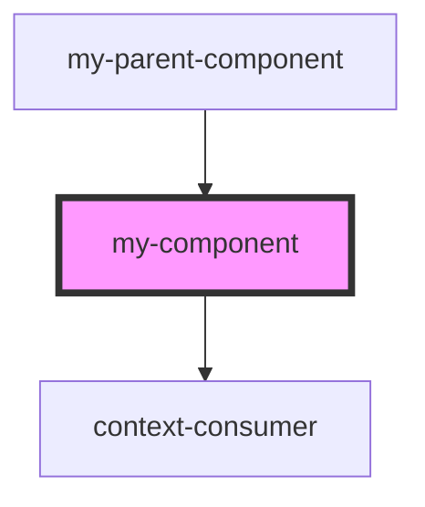

# my-component

<!-- Auto Generated Below -->

## Properties

| Property   | Attribute | Description     | Type                | Default     |
| ---------- | --------- | --------------- | ------------------- | ----------- |
| `first`    | `first`   | The first name  | `string`            | `undefined` |
| `last`     | `last`    | The last name   | `string`            | `undefined` |
| `middle`   | `middle`  | The middle name | `string`            | `undefined` |
| `userName` | --        |                 | `UserNameFormatter` | `undefined` |

## Dependencies

### Used by

 - [my-parent-component](../my-parent-component)

### Depends on

- context-consumer

### Graph

----------------------------------------------

*Built with [StencilJS](https://stenciljs.com/)*
