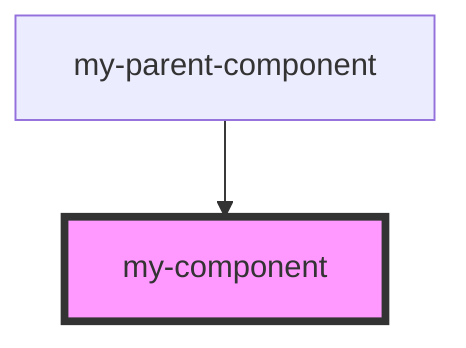

# my-component

<!-- Auto Generated Below -->

## Properties

| Property       | Attribute | Description     | Type                | Default     |
| -------------- | --------- | --------------- | ------------------- | ----------- |
| `first`        | `first`   | The first name  | `string`            | `undefined` |
| `last`         | `last`    | The last name   | `string`            | `undefined` |
| `logger`       | --        |                 | `Logger`            | `undefined` |
| `middle`       | `middle`  | The middle name | `string`            | `undefined` |
| `otherService` | --        |                 | `OtherService`      | `undefined` |
| `userName`     | --        |                 | `UserNameFormatter` | `undefined` |
| `userService`  | --        |                 | `UserService`       | `undefined` |

## Dependencies

### Used by

 - [my-parent-component](../my-parent-component)

### Graph

----------------------------------------------

*Built with [StencilJS](https://stenciljs.com/)*
