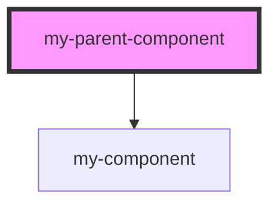

# my-parent-component

<!-- Auto Generated Below -->

## Dependencies

### Depends on

- [my-component](../my-component)

### Graph

----------------------------------------------

*Built with [StencilJS](https://stenciljs.com/)*
